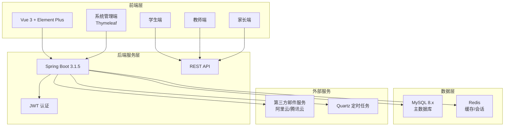

# 智慧校园管理平台 - 技术栈方案

## 一、项目定位

教育机构数字化管理解决方案

## 二、核心技术栈

### 1. 前端 (Vue)

*   **核心框架:** Vue 3
*   **UI 库:** Element Plus
*   **状态管理:** Pinia
*   **路由管理:** Vue Router
*   **构建工具:** Vite
*   **主要模块:**
    *   **学生端:** 选课系统、成绩查询、课程表、在线考试
    *   **教师端:** 课程管理、成绩录入、作业批改、班级管理
    *   **家长端:** 学生动态、成绩查看、缴费记录

### 2. 后端 (Spring Boot)

*   **核心框架:** Spring Boot 3.1.5
*   **编程语言:** Java 17
*   **项目构建工具:** Maven
*   **认证机制:** JWT (JSON Web Token)
*   **主要模块 (通过 API 服务前端):**
    *   教务管理相关接口
    *   财务管理相关接口
    *   学生、教师、家长功能接口

### 3. 后台管理 (Thymeleaf - 主要供系统管理员使用)

*   **模板引擎:** Thymeleaf
*   **主要模块:**
    *   **系统管理:** 用户权限、角色分配、系统配置
    *   **教务管理 (后台配置):** 课程安排、教师分配、学期设置
    *   **财务管理 (后台配置):** 学费管理、缴费统计、财务报表

### 4. 数据库

*   **主数据库:** MySQL 8.x

### 5. 缓存

*   **技术:** Redis
*   **应用场景:**
    *   JWT 会话管理与续期
    *   热点数据缓存，例如：课程信息、用户权限、系统配置等，以提升访问速度

### 6. 关键业务支撑技术

*   **定时任务:** Quartz
    *   自动排课算法执行
    *   定时成绩统计与分析
    *   自动缴费提醒推送
*   **邮件服务:** 第三方邮件服务（阿里云/腾讯云企业邮箱服务）
    *   学生成绩通知邮件
    *   重要公告、系统通知邮件推送

## 三、业务亮点梳理

*   **统一认证与安全:** 基于 JWT 的无状态认证，结合 Redis 进行会话管理，确保系统安全
*   **智能化定时服务:** 通过 Quartz 定时任务自动处理常规教务、财务工作，减轻人工压力
*   **专业邮件推送:** 集成第三方企业邮箱服务，确保重要信息能够稳定、及时触达相关用户
*   **高效数据访问:** 合理运用 Redis 缓存策略，优化高频访问数据接口的性能

## 四、技术架构图



## 五、开发环境与工具

*   **版本控制:** Git
*   **API 接口文档:** OpenAPI/Swagger（推荐）
*   **部署方案:** Docker（推荐）
*   **开发工具:**
    *   前端：VS Code + Vue DevTools
    *   后端：IntelliJ IDEA + Spring Boot DevTools

## 六、项目结构规划

```
Smart-Campus-Management/
├── campus-management-frontend/     # Vue 前端项目
│   ├── src/
│   │   ├── components/            # 公共组件
│   │   ├── views/                 # 页面组件
│   │   │   ├── student/          # 学生端页面
│   │   │   ├── teacher/          # 教师端页面
│   │   │   └── parent/           # 家长端页面
│   │   ├── stores/               # Pinia 状态管理
│   │   ├── router/               # Vue Router 路由配置
│   │   └── api/                  # API 接口调用
│   ├── package.json
│   └── vite.config.js
├── campus-management-backend/      # Spring Boot 后端项目
│   ├── src/main/java/
│   │   ├── controller/           # 控制器层
│   │   ├── service/              # 服务层
│   │   ├── repository/           # 数据访问层
│   │   ├── entity/               # 实体类
│   │   ├── config/               # 配置类
│   │   ├── security/             # 安全配置
│   │   ├── scheduler/            # 定时任务
│   │   └── utils/                # 工具类
│   ├── src/main/resources/
│   │   ├── templates/            # Thymeleaf 模板
│   │   ├── static/               # 静态资源
│   │   └── application.yml       # 配置文件
│   └── pom.xml
└── docs/                          # 项目文档
    ├── api/                      # API 文档
    ├── database/                 # 数据库设计文档
    └── deployment/               # 部署文档
```

## 七、后续开发计划

1. **数据库设计:** 设计用户、课程、成绩、财务等核心业务表结构
2. **后端 API 开发:** 基于 Spring Boot 开发 REST API 接口
3. **前端页面开发:** 基于 Vue 3 + Element Plus 开发各端用户界面
4. **系统集成测试:** 前后端联调，功能测试
5. **部署上线:** 配置生产环境，Docker 部署
